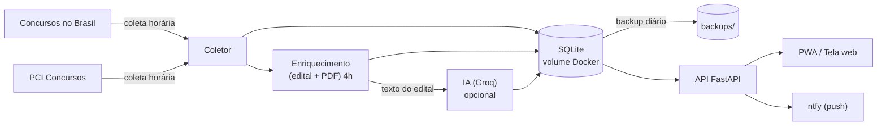

<div align="center">

# 🎯 Rastreador de Concursos

**Uma base sempre atualizada de concursos públicos do Brasil, com API REST e um app web instalável (PWA).**

Coleta os concursos de hora em hora, lê o edital automaticamente, mostra o prazo de inscrição, resume com IA (opcional) e funciona offline servindo o último estado bom salvo. Configurado com foco em **TI** nas regiões **Norte, Nordeste e Goiás**.


</div>

---

## 📑 Sumário

- [Por que existe](#-por-que-existe)
- [Funcionalidades](#-funcionalidades)
- [Como funciona](#-como-funciona)
- [Telas](#-telas)
- [Como rodar](#-como-rodar)
- [Configuração](#-configuração)
- [API REST](#-api-rest)
- [Filtro por área](#-filtro-por-área)
- [Resumo por IA](#-resumo-por-ia-opcional-e-gratuito)
- [Estrutura do projeto](#-estrutura-do-projeto)
- [Fonte de dados](#-fonte-de-dados)
- [Roadmap](#-roadmap)
- [Licença](#-licença)

---

## 💡 Por que existe

Procurar concurso é chato: a informação fica espalhada, alguns sites caem e nem sempre dá para filtrar do jeito que você quer. Este projeto resolve isso guardando tudo num banco local próprio. Mesmo que a fonte fique fora do ar, o app continua respondendo com o último estado bom salvo, e os filtros rodam sempre em cima do banco local (rápido e confiável).

## ✨ Funcionalidades

- 🔄 **Coleta automática** de hora em hora (no boot e via agendador).
- 🔗 **Link direto** para a página de cada concurso (edital, datas e detalhes).
- 📅 **Data de encerramento das inscrições**, lida automaticamente da página e do PDF.
- 🧠 **Informação rica por concurso**: banca, escolaridade, salário (faixa), vagas, jornada, data da prova e cargos de TI, extraídos automaticamente.
- 📄 **Leitura automática do edital em PDF** (quando encontrado) e botão para baixar.
- 🎯 **Foco em TI**: filtre por **TI** nos chips de área e veja **"o que cai"** — o conteúdo programático de TI extraído do edital — além de um **plano de estudo consolidado** (o que mais se repete nos concursos de TI abertos).
- 🤖 **Resumo por IA (opcional)**: com uma chave grátis da Groq, gera um resumo e um plano de estudo de TI por concurso, e responde **"perguntas sobre o edital"**. Sem chave, o app funciona normal (heurística).
- 📅 **Calendário (.ics)**: adicione prazos de inscrição e datas de prova ao calendário do celular, por concurso ou de todos os favoritos.
- 🔔 **Notificações no celular (ntfy)** + **resumo diário (digest)** dos novos concursos de TI.
- 🎓 **Treinar com provas anteriores**: busca provas e gabaritos no PCI Concursos por cargo, com link para baixar. Cada concurso também tem um atalho de provas anteriores.
- ⏳ **Prazo em primeiro lugar**: esconde inscrições já encerradas (com um toque para incluir) e mostra primeiro os concursos que encerram mais cedo.
- ⭐ **Favoritar, acompanhar prazos** e marcar **"já me inscrevi"** para organizar onde você já entrou.
- 🗂️ **Mais de uma fonte**: agrega o **Concursos no Brasil** e o **PCI Concursos**, deduplicando automaticamente o mesmo concurso entre as fontes.
- 🔎 **Busca por várias palavras** (acha por todos os termos, em qualquer ordem) e **filtros** por estado, área, tipo e escolaridade.
- 💾 **Backup automático** diário do banco (mantém as N cópias mais recentes), pensado para servidores em cartão SD (Raspberry Pi).
- 🧭 **Foco regional** (Norte + Nordeste + Goiás) com atalhos para cidades do Pará.
- 📱 **PWA instalável** no celular, com modo offline servindo os últimos dados.
- 🐳 **Sobe com um comando** via Docker Compose, ideal para Umbrel/Portainer.

## 🏗️ Como funciona



1. O **coletor** varre os estados do **foco** (regiões Norte e Nordeste + Goiás), os concursos **nacionais/federais** e os previstos, nas duas fontes (de hora em hora). O foco é configurável pela variável `UFS_FOCO`.
2. O **enriquecimento** (uma vez por dia, às 4h, e no boot) abre a página de cada concurso, extrai datas, banca, escolaridade, salário, vagas e cargos de TI, e tenta **ler o PDF do edital**.
3. Tudo é gravado no **SQLite**, deduplicando o mesmo concurso entre as fontes por uma chave (órgão + UF + prazo).
4. Se houver uma **chave de IA** configurada, a leitura diária também gera um resumo e um plano de estudo de TI por concurso.
5. Quando surge um concurso novo do seu **perfil**, o app envia um push via **ntfy** (e um **resumo diário** dos novos de TI).
6. Um **backup diário** do banco é guardado em `backups/`, mantendo só as cópias mais recentes.

## 🖼️ Telas

> Dica: adicione aqui um print do app rodando (por exemplo em `docs/tela.png`).

<!--  -->

A tela tem uma barra de busca única, chips de área, seletores de estado e escolaridade, atalhos da região do Pará e cards com órgão, descrição, vagas, salário e prazo de inscrição. Tocar em um card abre os detalhes com o período de inscrição, o resumo (e, com IA, o plano de estudo), e os botões **Site oficial / inscrição**, **Baixar edital (PDF)**, **Ver matéria**, **Adicionar ao calendário** e **Pergunte ao edital**.

## 🚀 Como rodar

Você só precisa de **Docker** e **Docker Compose**:

```bash
docker compose up --build
```

Depois acesse:

| O quê | Endereço |
| --- | --- |
| Tela web | http://localhost:8723 |
| API | http://localhost:8723/api/concursos |

> No celular, na mesma rede, use `http://SEU_IP_LOCAL:8723` e toque em **Instalar o app** (ou **Adicionar à tela inicial**).

A primeira coleta começa em segundo plano assim que o app sobe, então os primeiros resultados aparecem em alguns segundos. As datas e os editais vão sendo preenchidos aos poucos (o app mostra o progresso "lendo editais X/Y").

### Rodar no Umbrel (via Portainer)

No Umbrel, instale o app **Portainer** e crie uma *stack* a partir deste repositório:

1. **Portainer → Stacks → Add stack**.
2. **Build method: Repository**. Em *Repository URL*, use
   `https://github.com/C03LHO/Rastreador-de-Concursos` e *Compose path*
   `docker-compose.yml`.
3. **Deploy the stack**. O Portainer clona o repo e constrói a imagem (o
   `docker-compose.yml` usa `build: .`).
4. Acesse `http://IP-DO-UMBREL:8723` no celular e toque em **Instalar o app**.

Para **atualizar** depois, é só **Pull and redeploy** na stack do Portainer (ou
`git pull && docker compose up --build -d` por terminal). O banco fica num
**volume** (`concursos_dados`), então sobrevive às atualizações; os backups
diários ficam em `backups/` dentro do mesmo volume.

> A configuração de notificações (ntfy) e da IA (chave Groq) é feita **dentro
> do app**, na tela **Perfil** — sem mexer em terminal.

### Rodar sem Docker (opcional)

```bash
pip install -r requirements.txt
uvicorn app.main:app --reload --port 8723
```

## ⚙️ Configuração

Tudo é configurável por variáveis de ambiente (já definidas no `docker-compose.yml`):

| Variável | Padrão | O que faz |
| --- | --- | --- |
| `DB_PATH` | `/data/concursos.db` | Caminho do arquivo SQLite (persistido no volume). |
| `UFS_FOCO` | Norte+Nordeste+GO | Estados a coletar (siglas separadas por vírgula). Vazio usa o foco padrão. Os nacionais/federais entram sempre. |
| `INTERVALO_HORAS` | `1` | Intervalo da coleta da listagem, em horas. |
| `HORA_LEITURA` | `4` | Hora (fuso America/Belem) da leitura diária completa dos editais. |
| `MAX_PREVISTOS` | `500` | Quantos concursos previstos guardar (os mais recentes). |
| `LER_PDF` | `1` | Liga/desliga a leitura automática do PDF do edital (`0` desliga). |
| `LOTE_DETALHES` | `20` | Quantos concursos ler por lote no enriquecimento. |
| `HORA_AVISO_PRAZO` | `8` | Hora do lembrete diário de prazo dos favoritos. |
| `PRAZO_AVISO_DIAS` | `3` | Avisar quando um favorito encerrar em até N dias. |
| `HORA_DIGEST` | `7` | Hora do resumo diário (digest) dos novos concursos de TI. |
| `HORA_BACKUP` | `3` | Hora do backup diário do banco. |
| `MAX_BACKUPS` | `15` | Quantas cópias de backup manter (as mais antigas são apagadas). |
| `IA_MODELO` | `llama-3.1-8b-instant` | Modelo usado no resumo por IA (opcional; configure a chave no app). |
| `IA_MAX_POR_RODADA` | `60` | Quantos concursos de TI resumir por rodada de IA (respeita o limite grátis). |

## 🔌 API REST

| Método | Rota | Descrição |
| --- | --- | --- |
| `GET` | `/` | Serve a tela web (PWA). |
| `GET` | `/api/concursos` | Lista os concursos com filtros opcionais. |
| `GET` | `/api/concursos.csv` | Exporta os concursos filtrados em CSV (mesmos filtros). |
| `GET` | `/api/calendario.ics` | Calendário (.ics) com prazos e provas dos favoritos (ou `?hash=` de um). |
| `GET` | `/api/areas` | Lista as áreas disponíveis. |
| `GET` | `/api/status` | Total no banco, progresso da leitura de editais e última coleta. |
| `GET` | `/api/health` | Verificação leve (usada pelo healthcheck do Docker). |
| `GET` | `/api/provas?q=<cargo>` | Provas anteriores do PCI Concursos (aba Treinar). |
| `GET` | `/api/perfil` | Lê o perfil de interesse salvo. |
| `POST` | `/api/perfil` | Salva o perfil (estados, termos, áreas e ntfy). |
| `POST` | `/api/notificar-teste` | Dispara uma notificação de teste no ntfy. |
| `POST` | `/api/ia-teste` | Valida a chave/modelo de IA (Groq). |
| `POST` | `/api/ia-gerar` | Gera os resumos de IA dos concursos de TI pendentes. |
| `POST` | `/api/perguntar` | Pergunte ao edital: `{hash, pergunta}` e a IA responde. |
| `POST` | `/api/backup` | Faz um backup imediato do banco (rotaciona em `MAX_BACKUPS`). |
| `GET` | `/api/favoritos` | Lista os concursos favoritados (ordenados por prazo). |
| `POST` | `/api/favoritos/{hash}` | Favorita ou desfavorita um concurso. |
| `GET` | `/api/inscritos` | Hashes marcados como "já me inscrevi". |
| `POST` | `/api/inscritos/{hash}` | Alterna o "já me inscrevi" de um concurso. |
| `GET` | `/api/plano-estudo` | Plano de estudo consolidado dos concursos de TI abertos. |
| `POST` | `/api/coletar` | Força uma coleta imediata (em segundo plano). |

**Filtros de `/api/concursos`** (todos opcionais, combinados em E lógico): `uf`, `area`, `cidade`, `cargo`, `tipo` (`aberto`/`previsto`), `q` (busca livre, multi-palavra), `nivel` (escolaridade: `fundamental`/`medio`/`tecnico`/`superior`) e `limite`. A resposta é `{ "total": N, "concursos": [...] }`.

```bash
# Concursos de TI no Pará
curl "http://localhost:8723/api/concursos?uf=pa&area=ti"

# Busca livre por professor, somente abertos
curl "http://localhost:8723/api/concursos?q=professor&tipo=aberto"

# Concursos em Parauapebas
curl "http://localhost:8723/api/concursos?uf=pa&q=parauapebas"
```

Cada concurso retorna, entre outros campos: `orgao`, `titulo`, `uf`, `tipo`, `vagas`, `link`, `data_inicio`, `data_fim` (encerramento), `link_oficial` e `pdf_url`.

## 🧠 Filtro por área

As áreas e suas palavras-chave ficam em [`app/areas.py`](app/areas.py) e são fáceis de editar. Ao filtrar por uma área (por exemplo `ti`), o app procura **qualquer uma** das palavras dentro do texto do concurso, casando por **palavra inteira** (assim a área `ti` não casa por engano dentro de "Tocantins" ou "aeronáutica"). A busca também é **insensível a acento**.

Áreas incluídas: `ti`, `saude`, `educacao`, `juridico`, `administrativo`, `engenharia`, `seguranca` e `fiscal_financeiro`.

## 🔔 Perfil e notificações

Na tela **Perfil** (ícone de pessoa no topo) você define seus interesses: estados,
áreas e órgãos/cidades (ex: `Parauapebas`, `Canaã dos Carajás`). Quando a coleta
encontra um concurso novo que casa com o perfil, o app envia um **push via ntfy**.

Para ativar:

1. Instale o app **ntfy** no celular (Android/iOS) ou rode o ntfy no seu Umbrel.
2. Em Perfil, marque "Me notificar", informe o **servidor** (padrão `https://ntfy.sh`)
   e um **tópico** único e secreto (ex: `meus-concursos-9f3a`).
3. Assine esse mesmo tópico no app ntfy. Use "Enviar teste" para confirmar.

Você recebe: concursos novos do seu perfil, lembrete quando um **favorito** está
perto de encerrar e um **resumo diário** (digest) dos novos concursos de TI.

## ⭐ Favoritos e prazos

Toque na **estrela** de qualquer concurso para salvá-lo. Na tela **Favoritos**
(ícone de estrela no topo) eles aparecem ordenados pelo prazo de inscrição (o que
encerra antes vem primeiro). Com as notificações ativas, você recebe um lembrete
por push quando o prazo de um favorito estiver perto (padrão: 3 dias antes).

## 🎓 Treinar com provas

Na tela **Treinar** (ícone de livro no topo), busque por um cargo (ex: `professor`,
`guarda`, `analista`) para listar **provas anteriores** do PCI Concursos, com link
para baixar lá. Cada concurso também tem um botão **Provas anteriores** que já abre
a busca pelo cargo. Respeitamos o `robots.txt` do PCI: o app apenas lista e linka,
sem baixar os PDFs no servidor.

## 🤖 Resumo por IA (opcional e gratuito)

Por padrão o app extrai as informações por heurística (leve, roda em qualquer
lugar). Se quiser um **resumo em linguagem natural** e um **plano de estudo de
TI** por concurso, cole uma chave **gratuita** da [Groq](https://console.groq.com/keys)
em **Perfil → Inteligência (IA)** e toque em **Testar IA**. A partir daí, a
leitura diária gera o resumo e o **plano de estudo de TI** dos concursos (usando
o texto do edital já lido, sem peso de processamento no servidor), e você pode
usar o **"Pergunte ao edital"** no detalhe de cada concurso. **Sem chave, nada
muda** (o app usa a extração por heurística). É compatível com qualquer endpoint
no formato OpenAI (Groq, etc.), configurável por `IA_MODELO`/`IA_KEY`.

## 🗂️ Estrutura do projeto

```
.
├─ docker-compose.yml
├─ Dockerfile
├─ requirements.txt
├─ README.md
└─ app/
   ├─ main.py            # FastAPI, rotas e agendador
   ├─ collector.py       # coleta, enriquecimento e leitura de PDF
   ├─ db.py              # SQLite (schema, busca, upsert)
   ├─ areas.py           # mapa de áreas -> palavras-chave
   ├─ static/            # PWA: manifest, service worker, ícones
   └─ templates/
      └─ index.html      # app web (HTML/CSS/JS puro)
```

## 📥 Fonte de dados

Os dados vêm do site gratuito **Concursos no Brasil** (`https://concursosnobrasil.com`):

- Abertos por estado: `/concursos/<uf>/`
- Abertos nacionais (órgãos federais como Exército e Marinha): `/concursos/`
- Previstos (página nacional, pegamos os mais recentes): `/concursos/previstos/`
- Detalhe de cada concurso: a própria página do concurso, de onde extraímos a data de encerramento, o link oficial e o PDF do edital.

Uma **segunda fonte de listagem**, o **PCI Concursos**
(`https://www.pciconcursos.com.br/concursos/`), amplia a cobertura. O mesmo concurso
que aparece nas duas fontes é deduplicado por uma chave (órgão + UF + data de
encerramento), que inclui o prazo de propósito: assim concursos distintos de um mesmo
órgão (cargos/editais diferentes) nunca são fundidos por engano, e o item do Concursos
no Brasil (mais completo) é o que fica.

O banco usa **WAL** no SQLite, então o app continua respondendo rápido mesmo enquanto
a coleta e a leitura dos editais gravam em segundo plano.

As **provas anteriores** (aba Treinar) também vêm do PCI
(`https://www.pciconcursos.com.br/provas/`), apenas listando e linkando (sem baixar
os PDFs, respeitando o `robots.txt`).

A coleta é **defensiva**: se a estrutura de uma página mudar, aquele item é ignorado sem derrubar o resto, e o banco mantém o último estado bom salvo mesmo que a fonte fique fora do ar.

## 🧭 Roadmap

- [x] Data de encerramento, banca, salário, vagas e escolaridade por concurso.
- [x] Leitura automática do edital em PDF.
- [x] Perfil de interesse com notificação por ntfy + resumo diário (digest).
- [x] Treinar com provas anteriores (PCI Concursos).
- [x] Segundo agregador de fontes (PCI) com deduplicação.
- [x] Favoritar concursos, acompanhar prazos e marcar "já me inscrevi".
- [x] Exportar resultados (CSV) e calendário (.ics).
- [x] Foco regional (Norte/Nordeste/GO) e foco em TI com "o que cai".
- [x] Resumo por IA (Groq) + plano de estudo + "pergunte ao edital".
- [x] Backup automático do banco com rotação.
- [x] Busca por várias palavras e filtro por escolaridade.
- [ ] Quadro de cargos por edital (vagas/salário/requisitos por cargo).
- [ ] Detecção de edital retificado.
- [ ] Mais agregadores (Estuda Grátis, Folha Dirigida, etc.).

## 📄 Licença

Distribuído sob a licença **MIT**. Veja [`LICENSE`](LICENSE) para mais detalhes.

---

<div align="center">
Feito com Python, FastAPI e um banco que nunca dorme. ⏱️
</div>
