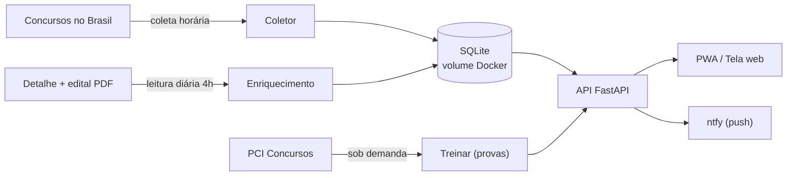

<div align="center">

# 🎯 Rastreador de Concursos

**Uma base sempre atualizada de concursos públicos do Brasil, com API REST e um app web instalável (PWA).**

Coleta os concursos de hora em hora, lê o edital automaticamente, mostra a data de encerramento das inscrições e funciona offline servindo o último estado bom salvo.


</div>

---

## 📑 Sumário

- [Por que existe](#-por-que-existe)
- [Funcionalidades](#-funcionalidades)
- [Como funciona](#-como-funciona)
- [Telas](#-telas)
- [Como rodar](#-como-rodar)
- [Configuração](#-configuração)
- [API REST](#-api-rest)
- [Filtro por área](#-filtro-por-área)
- [Estrutura do projeto](#-estrutura-do-projeto)
- [Fonte de dados](#-fonte-de-dados)
- [Roadmap](#-roadmap)
- [Licença](#-licença)

---

## 💡 Por que existe

Procurar concurso é chato: a informação fica espalhada, alguns sites caem e nem sempre dá para filtrar do jeito que você quer. Este projeto resolve isso guardando tudo num banco local próprio. Mesmo que a fonte fique fora do ar, o app continua respondendo com o último estado bom salvo, e os filtros rodam sempre em cima do banco local (rápido e confiável).

## ✨ Funcionalidades

- 🔄 **Coleta automática** de hora em hora (no boot e via agendador).
- 🔗 **Link direto** para a página de cada concurso (edital, datas e detalhes).
- 📅 **Data de encerramento das inscrições**, lida automaticamente da página e do PDF.
- 🧠 **Informação rica por concurso**: banca, escolaridade, salário, taxa de inscrição e data da prova, extraídos automaticamente.
- 📄 **Leitura automática do edital em PDF** (quando encontrado) e botão para baixar.
- 🎓 **Treinar com provas anteriores**: busca provas e gabaritos no PCI Concursos por cargo, com link para baixar. Cada concurso também tem um atalho de provas anteriores.
- 🔔 **Perfil e notificações**: você escolhe estados, órgãos/cidades e áreas de interesse, e recebe um push no celular (via **ntfy**) quando surge um concurso novo do seu perfil.
- 🌙 **Leitura diária às 4h**: a parte pesada (ler todos os editais) roda uma vez por dia de madrugada, configurável.
- 🧭 **Foco na região do Pará**: atalhos rápidos para Belém, Marabá, Parauapebas, Canaã dos Carajás, Curionópolis e outras.
- 🔎 **Busca inteligente**: insensível a acento e com filtro de área por palavra inteira.
- 📱 **PWA instalável** no celular, com modo offline servindo os últimos dados.
- 🐳 **Sobe com um comando** via Docker Compose, ideal para rodar no seu servidor (Umbrel, Portainer, etc.).

## 🏗️ Como funciona



1. O **coletor** varre os 27 estados (abertos), os concursos nacionais e os previstos (de hora em hora).
2. O **enriquecimento** (uma vez por dia, às 4h) abre a página de cada concurso, extrai datas, banca, escolaridade, salário e taxa, e tenta ler o PDF do edital.
3. Tudo é gravado no **SQLite**, com deduplicação pelo link.
4. Quando surge um concurso novo do seu **perfil**, o app envia um push via **ntfy**.
5. A aba **Treinar** busca provas anteriores no **PCI Concursos** sob demanda.

## 🖼️ Telas

> Dica: adicione aqui um print do app rodando (por exemplo em `docs/tela.png`).

<!--  -->

A tela tem uma barra de busca única, chips de área, seletor de estado, atalhos da região do Pará e cards com órgão, descrição, vagas e prazo de inscrição. Tocar em um card abre os detalhes com o período de inscrição e os botões **Abrir página do concurso**, **Baixar edital (PDF)** e **Site oficial / inscrição**.

## 🚀 Como rodar

Você só precisa de **Docker** e **Docker Compose**:

```bash
docker compose up --build
```

Depois acesse:

| O quê | Endereço |
| --- | --- |
| Tela web | http://localhost:8723 |
| API | http://localhost:8723/api/concursos |

> No celular, na mesma rede, use `http://SEU_IP_LOCAL:8723` e toque em **Instalar o app** (ou **Adicionar à tela inicial**).

A primeira coleta começa em segundo plano assim que o app sobe, então os primeiros resultados aparecem em alguns segundos. As datas e os editais vão sendo preenchidos aos poucos (o app mostra o progresso "lendo editais X/Y").

### Rodar sem Docker (opcional)

```bash
pip install -r requirements.txt
uvicorn app.main:app --reload --port 8723
```

## ⚙️ Configuração

Tudo é configurável por variáveis de ambiente (já definidas no `docker-compose.yml`):

| Variável | Padrão | O que faz |
| --- | --- | --- |
| `DB_PATH` | `/data/concursos.db` | Caminho do arquivo SQLite (persistido no volume). |
| `INTERVALO_HORAS` | `1` | Intervalo da coleta da listagem, em horas. |
| `HORA_LEITURA` | `4` | Hora (fuso America/Belem) da leitura diária completa dos editais. |
| `MAX_PREVISTOS` | `500` | Quantos concursos previstos guardar (os mais recentes). |
| `LER_PDF` | `1` | Liga/desliga a leitura automática do PDF do edital (`0` desliga). |
| `LOTE_DETALHES` | `20` | Quantos concursos ler por lote no enriquecimento. |

## 🔌 API REST

| Método | Rota | Descrição |
| --- | --- | --- |
| `GET` | `/` | Serve a tela web (PWA). |
| `GET` | `/api/concursos` | Lista os concursos com filtros opcionais. |
| `GET` | `/api/areas` | Lista as áreas disponíveis. |
| `GET` | `/api/status` | Total no banco, progresso da leitura de editais e última coleta. |
| `GET` | `/api/provas?q=<cargo>` | Provas anteriores do PCI Concursos (aba Treinar). |
| `GET` | `/api/perfil` | Lê o perfil de interesse salvo. |
| `POST` | `/api/perfil` | Salva o perfil (estados, termos, áreas e ntfy). |
| `POST` | `/api/notificar-teste` | Dispara uma notificação de teste no ntfy. |
| `POST` | `/api/coletar` | Força uma coleta imediata (em segundo plano). |

**Filtros de `/api/concursos`** (todos opcionais, combinados em E lógico): `uf`, `area`, `cidade`, `cargo`, `tipo` (`aberto`/`previsto`), `q` (busca livre) e `limite`. A resposta é `{ "total": N, "concursos": [...] }`.

```bash
# Concursos de TI no Pará
curl "http://localhost:8723/api/concursos?uf=pa&area=ti"

# Busca livre por professor, somente abertos
curl "http://localhost:8723/api/concursos?q=professor&tipo=aberto"

# Concursos em Parauapebas
curl "http://localhost:8723/api/concursos?uf=pa&q=parauapebas"
```

Cada concurso retorna, entre outros campos: `orgao`, `titulo`, `uf`, `tipo`, `vagas`, `link`, `data_inicio`, `data_fim` (encerramento), `link_oficial` e `pdf_url`.

## 🧠 Filtro por área

As áreas e suas palavras-chave ficam em [`app/areas.py`](app/areas.py) e são fáceis de editar. Ao filtrar por uma área (por exemplo `ti`), o app procura **qualquer uma** das palavras dentro do texto do concurso, casando por **palavra inteira** (assim a área `ti` não casa por engano dentro de "Tocantins" ou "aeronáutica"). A busca também é **insensível a acento**.

Áreas incluídas: `ti`, `saude`, `educacao`, `juridico`, `administrativo`, `engenharia`, `seguranca` e `fiscal_financeiro`.

## 🔔 Perfil e notificações

Na tela **Perfil** (ícone de pessoa no topo) você define seus interesses: estados,
áreas e órgãos/cidades (ex: `Parauapebas`, `Canaã dos Carajás`). Quando a coleta
encontra um concurso novo que casa com o perfil, o app envia um **push via ntfy**.

Para ativar:

1. Instale o app **ntfy** no celular (Android/iOS) ou rode o ntfy no seu Umbrel.
2. Em Perfil, marque "Me notificar", informe o **servidor** (padrão `https://ntfy.sh`)
   e um **tópico** único e secreto (ex: `meus-concursos-9f3a`).
3. Assine esse mesmo tópico no app ntfy. Use "Enviar teste" para confirmar.

## 🎓 Treinar com provas

Na tela **Treinar** (ícone de livro no topo), busque por um cargo (ex: `professor`,
`guarda`, `analista`) para listar **provas anteriores** do PCI Concursos, com link
para baixar lá. Cada concurso também tem um botão **Provas anteriores** que já abre
a busca pelo cargo. Respeitamos o `robots.txt` do PCI: o app apenas lista e linka,
sem baixar os PDFs no servidor.

## 🗂️ Estrutura do projeto

```
.
├─ docker-compose.yml
├─ Dockerfile
├─ requirements.txt
├─ README.md
└─ app/
   ├─ main.py            # FastAPI, rotas e agendador
   ├─ collector.py       # coleta, enriquecimento e leitura de PDF
   ├─ db.py              # SQLite (schema, busca, upsert)
   ├─ areas.py           # mapa de áreas -> palavras-chave
   ├─ static/            # PWA: manifest, service worker, ícones
   └─ templates/
      └─ index.html      # app web (HTML/CSS/JS puro)
```

## 📥 Fonte de dados

Os dados vêm do site gratuito **Concursos no Brasil** (`https://concursosnobrasil.com`):

- Abertos por estado: `/concursos/<uf>/`
- Abertos nacionais (órgãos federais como Exército e Marinha): `/concursos/`
- Previstos (página nacional, pegamos os mais recentes): `/concursos/previstos/`
- Detalhe de cada concurso: a própria página do concurso, de onde extraímos a data de encerramento, o link oficial e o PDF do edital.

As **provas anteriores** (aba Treinar) vêm do **PCI Concursos**
(`https://www.pciconcursos.com.br/provas/`), apenas listando e linkando (sem baixar
os PDFs, respeitando o `robots.txt`).

A coleta é **defensiva**: se a estrutura de uma página mudar, aquele item é ignorado sem derrubar o resto, e o banco mantém o último estado bom salvo mesmo que a fonte fique fora do ar.

## 🧭 Roadmap

- [x] Data de encerramento, banca, salário e escolaridade por concurso.
- [x] Leitura automática do edital em PDF.
- [x] Perfil de interesse com notificação por ntfy.
- [x] Treinar com provas anteriores (PCI Concursos).
- [ ] Segundo agregador de fontes para ampliar a cobertura.
- [ ] Favoritar concursos e acompanhar prazos.
- [ ] Exportar resultados (CSV / JSON).

## 📄 Licença

Distribuído sob a licença **MIT**. Veja [`LICENSE`](LICENSE) para mais detalhes.

---

<div align="center">
Feito com Python, FastAPI e um banco que nunca dorme. ⏱️
</div>
